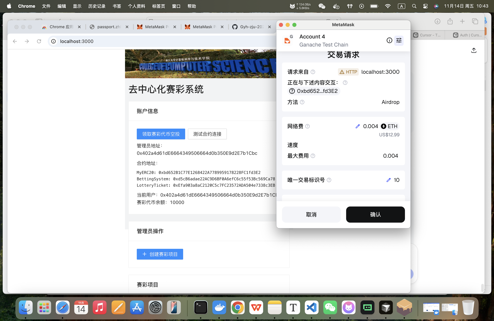
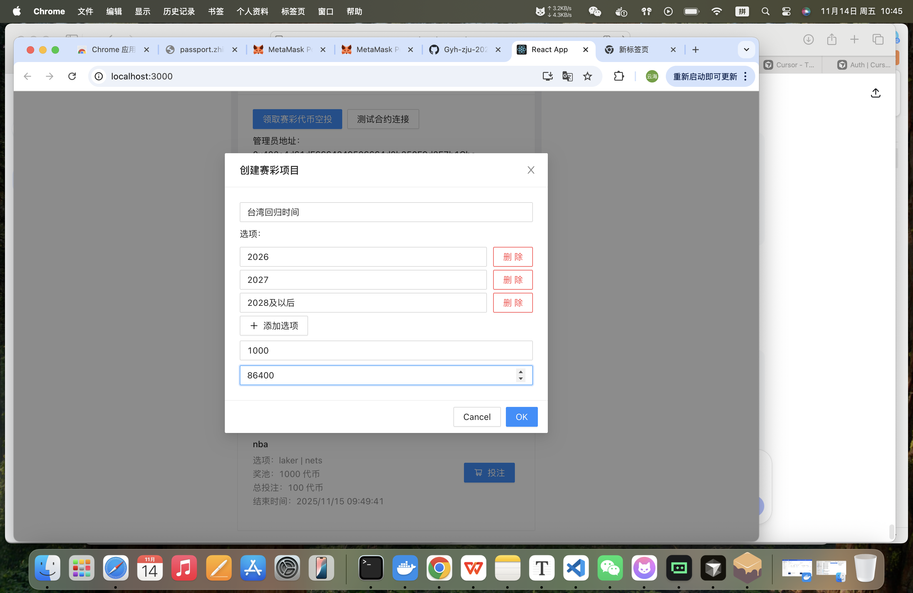
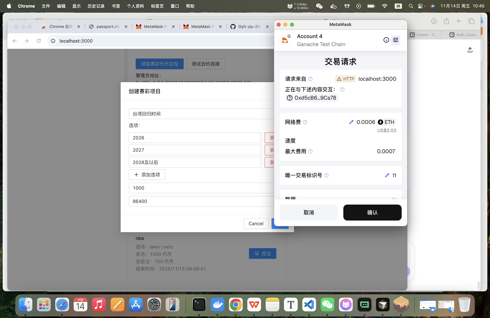
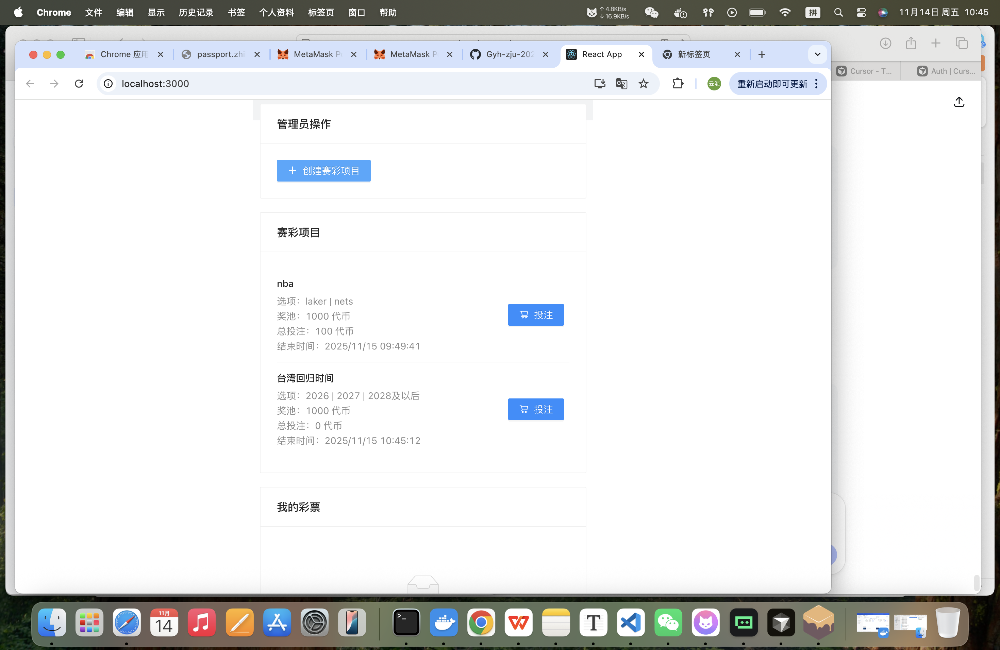
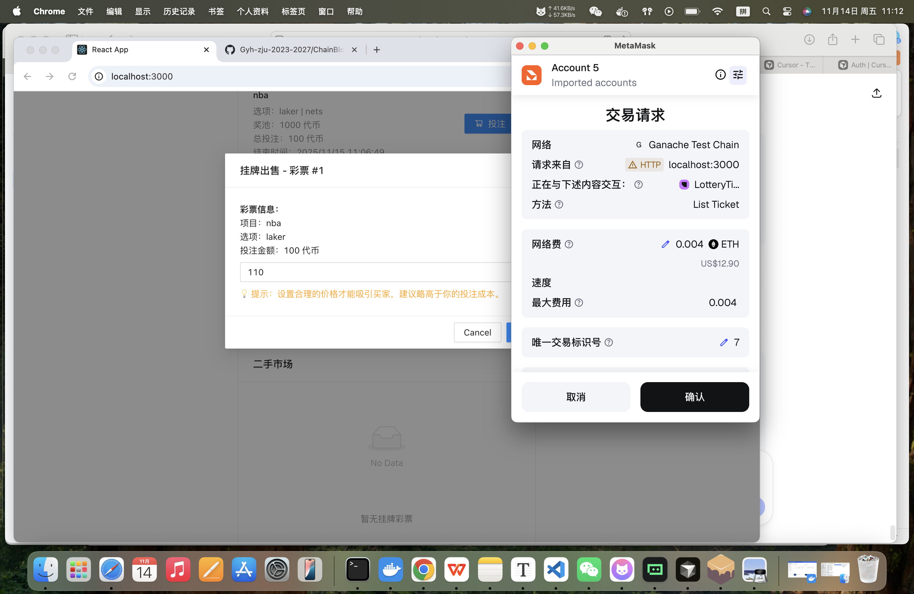
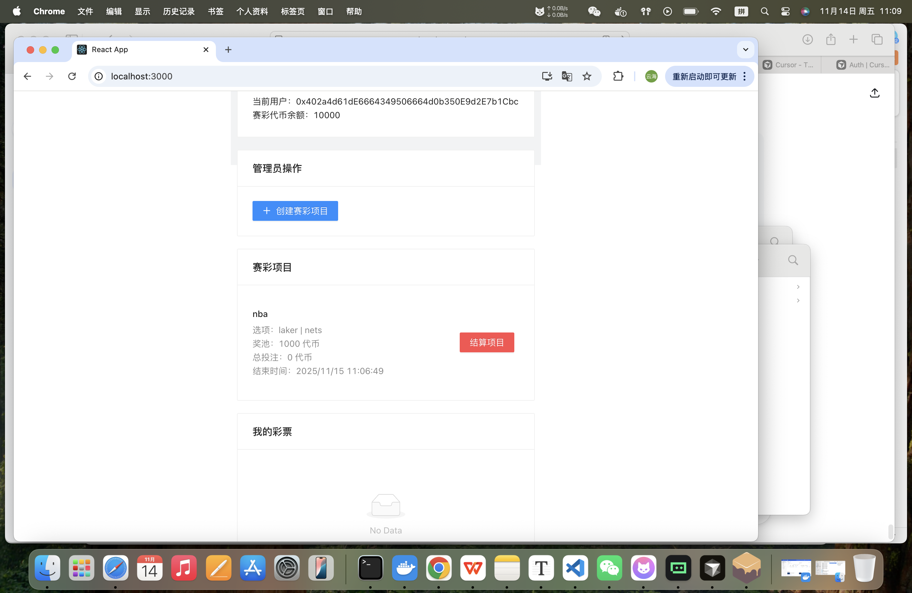
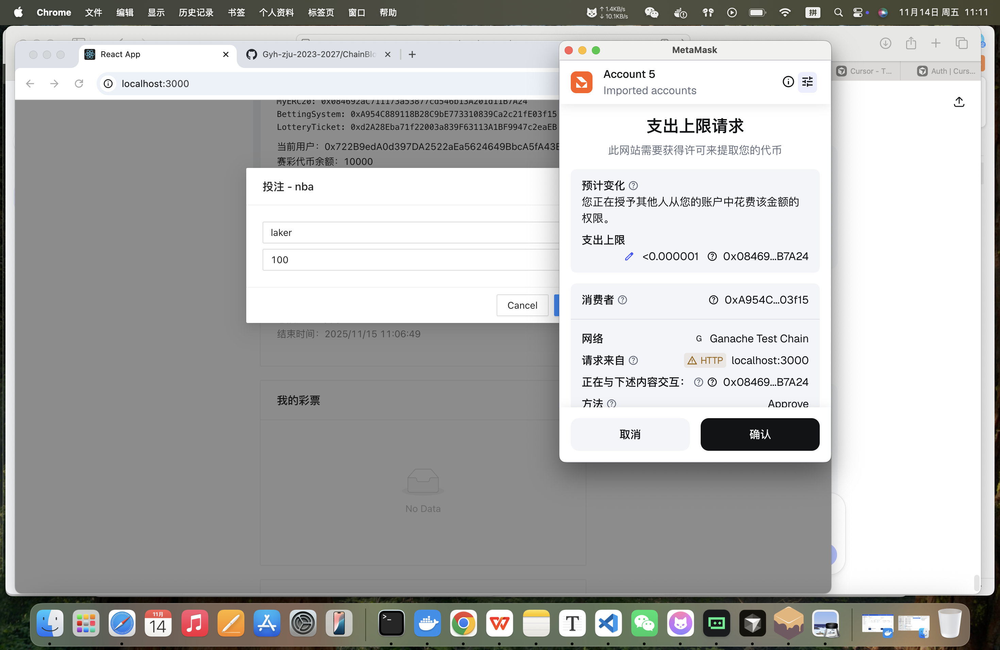
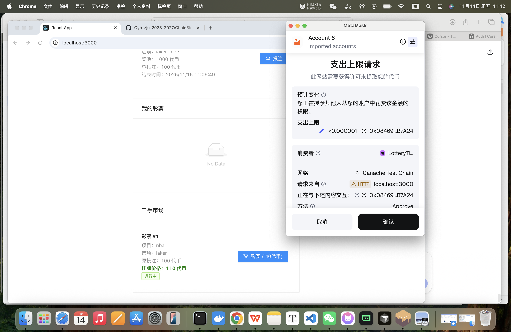
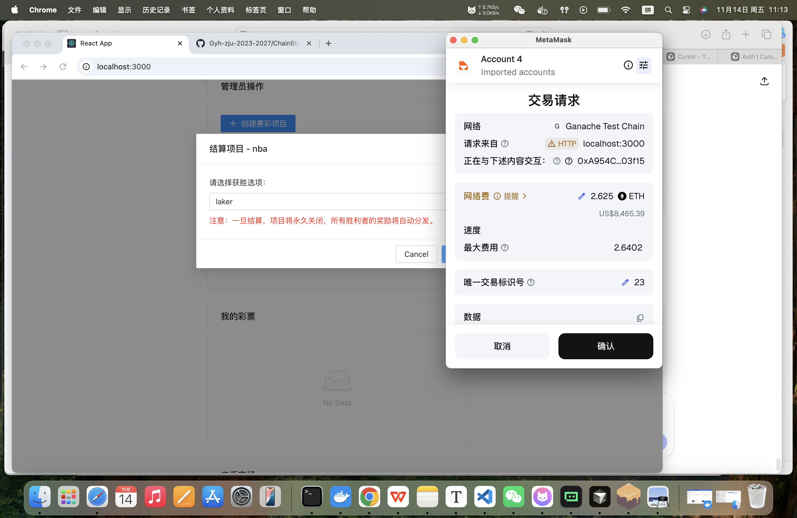

# 🎰 去中心化赛彩系统 (Decentralized Betting System)

[](https://ethereum.org/)
[](https://soliditylang.org/)
[](https://reactjs.org/)
[](https://www.typescriptlang.org/)

基于以太坊的去中心化赛彩平台，支持多项目竞猜，ERC721彩票凭证，二级市场交易。

## 📋 目录

- [🎯 项目简介](#-项目简介)
- [✨ 核心特性](#-核心特性)
- [🚀 快速开始](#-快速开始)
- [📦 安装部署](#-安装部署)
- [🎮 使用指南](#-使用指南)
- [📸 界面截图](#-界面截图)
- [📚 API 文档](#-api-文档)
- [❓ 故障排除](#-故障排除)

## 🎯 项目简介

基于以太坊的去中心化赛彩平台，支持体育赛事、选秀节目等竞猜活动。采用ERC721作为彩票凭证，实现数字资产交易。

**核心创新**：
- 完全去中心化，无需信任第三方
- ERC721 NFT彩票，支持二级市场交易
- 智能合约保证公平透明的结算

## ✨ 核心特性

- **多项目赛彩**：支持同时运行多个竞猜项目
- **ERC721彩票**：获得NFT凭证，可永久保存
- **二级市场**：玩家间自由交易彩票
- **公平结算**：智能合约自动按比例分配奖励

## 🚀 快速开始

### 一键启动
```bash
git clone <your-repo-url>
cd demo-lottery-application
./start.sh
```

### 手动启动
```bash
# 1. 启动区块链网络
npx ganache-cli --port 8545 --deterministic

# 2. 部署合约
cd contracts && npm install && npx hardhat run scripts/deploy.ts --network ganache

# 3. 启动前端
cd ../lottery-frontend && npm install && npm start
```

访问：http://localhost:3000

## 📦 安装部署

### 系统要求
- Node.js 16+
- npm 7+
- MetaMask 浏览器扩展

### 配置 MetaMask
1. 添加本地网络：
   - 网络名称: `Ganache Local`
   - RPC URL: `http://127.0.0.1:8545`
   - Chain ID: `1337`
2. 导入测试账户私钥：
   ```
   0xaf961e56824bc8e6617c4107413ed34f9c85a11ef84b3834e45c825bc2d0111b
   ```

## 🎮 使用指南

### 管理员操作
1. 连接管理员钱包
2. 创建赛彩项目（设置标题、选项、奖池、时间）
3. 等待用户投注
4. 项目到期后公布结果并结算

### 玩家操作
1. 连接钱包并领取测试代币
2. 浏览项目并选择投注
3. 获得ERC721彩票凭证
4. 可在二级市场交易彩票
5. 等待结算获得奖励

### 奖金计算
奖励 = (个人投注金额 ÷ 获胜选项总投注) × (管理员奖池 + 所有投注总金额)

## 📸 界面截图

### 💰 申请空投代币

*用户申请领取测试代币*

### 🏗️ 创建彩票项目

*管理员创建赛彩项目表单*

### 🔗 创建彩票时的MetaMask交互

*创建项目时的区块链交易确认*

### 📋 显示已有彩票列表

*用户查看已拥有的彩票凭证*

### 👑 管理员手动结算按钮

*管理员可看到手动结算项目按钮*

### 🎲 投注彩票

*用户选择投注选项和金额*

### 💸 挂牌出售彩票

*用户设置彩票挂牌价格*

### 🛒 购买别人挂牌的彩票

*用户从市场购买他人挂牌的彩票*

### ⚖️ 管理员手动结算详情

*管理员选择获胜选项并结算项目*

## 📚 API 文档

### 核心合约接口

#### BettingSystem 合约
- `createProject(title, options, pool, duration)` - 创建赛彩项目
- `placeBet(projectId, optionId, amount)` - 投注
- `settleProject(projectId, winnerOptionId)` - 结算项目

#### LotteryTicket 合约 (ERC721)
- `mintTicket(to, bettingId, optionId, amount)` - 铸造彩票
- `listTicket(tokenId, price)` - 挂牌出售
- `buyTicket(tokenId)` - 购买彩票

#### MyERC20 合约
- `airdrop()` - 领取代币空投
- `balanceOf(account)` - 查询余额

## ❓ 故障排除

### 常见问题

**Q: 合约编译失败**
A: 确保安装了所有依赖，运行 `npm install`

**Q: MetaMask 连接失败**
A: 检查是否安装了 MetaMask 扩展，刷新页面后重试

**Q: 交易失败**
A: 检查账户是否有足够测试 ETH，确认网络设置正确

**Q: 无法领取空投**
A: 每个账户只能领取一次空投

## 📄 许可证

MIT License
